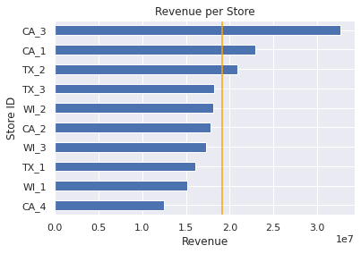
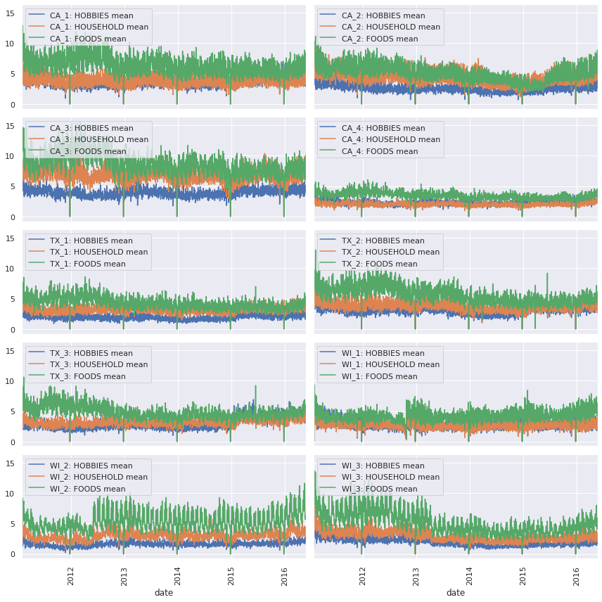
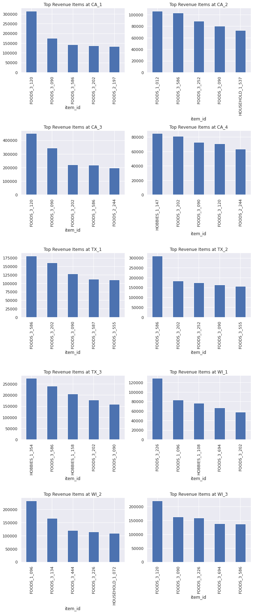

# M5 Forecasting Competition
------------

### About
This project is perfect for exploring and learning about the many facets of timeseries data. The data was obtained from the Kaggle website as part of the latest M series competition, created by forecasting legend Spyros Makridakis, as a way for the data science and statistical communities to come together and compare classic and emerging forecasting technologies.

There are over 5k participants who are all working together as a community to analyze data, create helper functions for others to use, create various models, run hyperparameter searches, etc.

The amount of collaboration shown by the exchange of ideas and methods is very impressive, and is encouraging to see as a data scientist.

From the [M5 Competition Website](https://mofc.unic.ac.cy/m5-competition/):
<blockquote>
The aim of the M5 Competition is similar to the previous four: that is to identify the most appropriate method(s) for different types of situations requiring predictions and making uncertainty estimates. Its ultimate purpose is to advance the theory of forecasting and improve its utilization by business and non-profit organizations. Its other goal is to compare the accuracy/uncertainty of ML and DL methods vis-à-vis those of standard statistical ones, and assess possible improvements versus the extra complexity and higher costs of using the various methods.</blockquote>

During the competition we completed several different models for prediction, including: ARIMA, Deep Neural Network, LSTM Neural Network, LightGBM, and Facebook Prophet.

The models results varied widely, with the ARIMA, LightGBM, and Facebook Prophet models producing the best scores.

In addition to creating the predictions, we set out to answer three seperate questions while we explored the data, as a way to ass business value to the entire process.

### Questions
Although the main goal of this competition is to create a highly accurate predictive model, we chose to focus on additional questions we could answer through our exploration of the dataset.

Some important questions we chose to address:
1. Which store and in which state do stores tend to generate more revenue?
2. Which products to sell in specific store(s)/state(s)
3. Which items sell the best during holidays?
4. (Possibly SNAP question)

### Purpose
We have been given a dataset of over 30,000 different items sold at Walmart, and we have been asked to create a 28 day prediction horizon for each of these items.

This dataset brings many different problems with it, including the sheer size of the dataset (over 58 million rows), the amount of zero values, and the complexity of generating hierchical predictions for over 30,000 different timeseries.

### Presentation
Online powerpoint style presentation:
[Click here for online non-technical presentation](TODO)

### Data
This dataset is part of an ongoing competition located on [Kaggle](https://www.kaggle.com/c/m5-forecasting-accuracy).

## Project Outline
------------

    ├── LICENSE
    ├── README.md                  <- The project layout (this file)
    ├── images                     <- For README.md and presentation
    │
    ├── notebooks                  <- Jupyter notebooks
    │   ├── obtain.ipynb           <- Process for obtaining data
    │   ├── scrub.ipynb            <- Process for cleaning the data
    │   ├── eda.ipynb              <- Process for exploring and analyzing the data
    │   └── model.ipynb            <- Process for modeling
    │
    ├── reports                    <- Reports and presentations
    │   ├── presentation.pdf       <- Non-technical presentation
    │   ├── blog.md                <- Blog post
    │   └── video_walkthrough      <- Link to video walkthrough
    │
    ├── predictions                <- Generated predictions in submission format
    │
    ├── models                     <- Trained models used for creating predictions
    │
    └── requirements.txt           <- The requirements file for reproducing the analysis environment
   

--------

## Recommendations
------------
1. In which state do the stores tend to be the most profitable?

Recommendation: Based on the limited data available pertaining to geographic location, we can recommend California as the highest revenue generating state. This does not take into account other factors though such as differences in cost of living, or population of the city (which we don't know from this dataset).

2. Which categories generate the most revenue, and which items in those categories tend to produce the most revenue?

We can see from the graphs that the 'food' category outsells the others 99% of the time. The only case where it is not the highest is in the 'CA_2' store, and only for some days.

 
Explanation: TODO

3. Which items sell best during the holidays, and which of these items sell better before the holiday vs after the holiday?

Explanation: TODO

## Conclusions
------------
TODO

